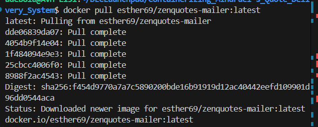

# Building and running Mindfuel's Quote Delivery System application
A containerized Python service that fetches a daily quote, connects to a PostgreSQL database, and sends emails to subscribed users.

## Prerequisites
- Docker
- Docker Hub account
- `.env` file with database and email credentials

## Steps followed
1. Docker file that contains all instruction to run the image created following docker command questions using `docker init`
2. Compose yaml file created which is used to configure Docker application’s services, networks, volumes, and more.
3. The Dockerfile file was modified

### Building locally
    docker build -t zenquotes-mailer .
    docker images
    docker ps -a

#### Running and Testing locally
    docker run --env-file .env zenquotes-mailer
    docker logs <container_id>

This verifies:

💠Quote is fetched from ZenQuotes API

💠Database connection works

💠Emails are sent successfully

**Tagging the image built**

I ensured the Docker image tag match on's Docker Hub username.

    docker tag zenquotes-mailer esther69/zenquotes-mailer:latest

verified with `docker images`

### Publishing to Docker Hub
    docker login
    docker push esther69/zenquote-mailer:latest

Link to confirm publish: [zenquotes-mailer image](https://hub.docker.com/r/esther69/zenquotes-mailer)

### Testing Pulled Image

**Deleted local image**

    docker rmi <image-id>

**Pulled from docker hub**

    docker pull esther69/zenquotes-mailer:latest

**Running it after pulling**

    docker run --env-file .env esther69/zenquotes-mailer:latest

### Notes

- Environment variables are injected at runtime using .env

- Logs are written to STDOUT for container observability

### Summary

Containerized a Python-based email delivery service using Docker, externalized configuration via environment variables, implemented stdout logging for container observability, and published the image to Docker Hub for portable deployment. Verified functionality post-pull including API integration, database connectivity, and SMTP email delivery.
